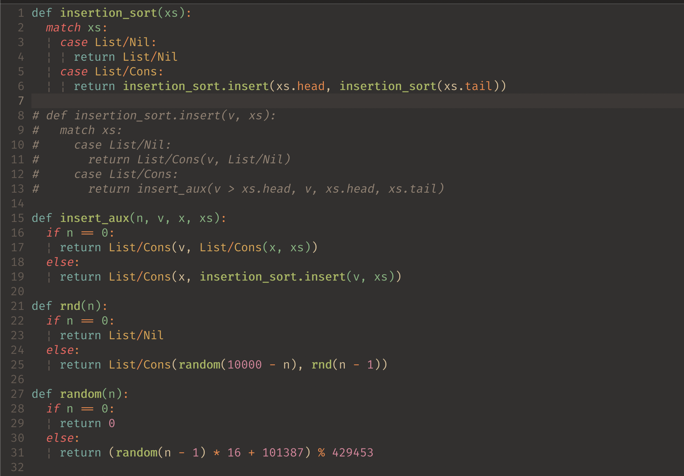

Special thanks to lunacookies for the original [`vim-rust-syntax-ext`](https://github.com/lunacookies/vim-rust-syntax-ext) project, which served as the foundation for adapting the syntax highlighting for `bend`. Your contribution has been crucial in making development with [`bend`](https://github.com/HigherOrderCO/Bend) more intuitive and productive. I apologize for not thanking you earlier; there was an issue with git that prevented me from identifying the original creator. Thank you very much, lunacookies!
